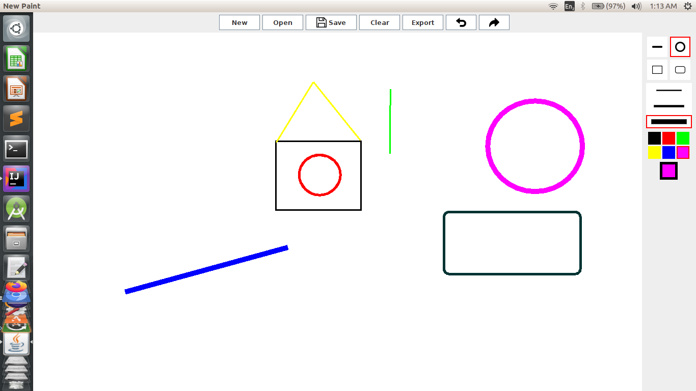

# Paint program(Java Swing)

 Similar to Paint program drawing some basic shapes like rectangle,circle,line. And exporting as an PNG image format  

 

" 

## Functionalities

**Redo**   
**Undo**     
**Save**      
**Open** (saved project from this program)  
**Export** (as an PNG image format)       
**Clear** (clearing all shapes)     
 
